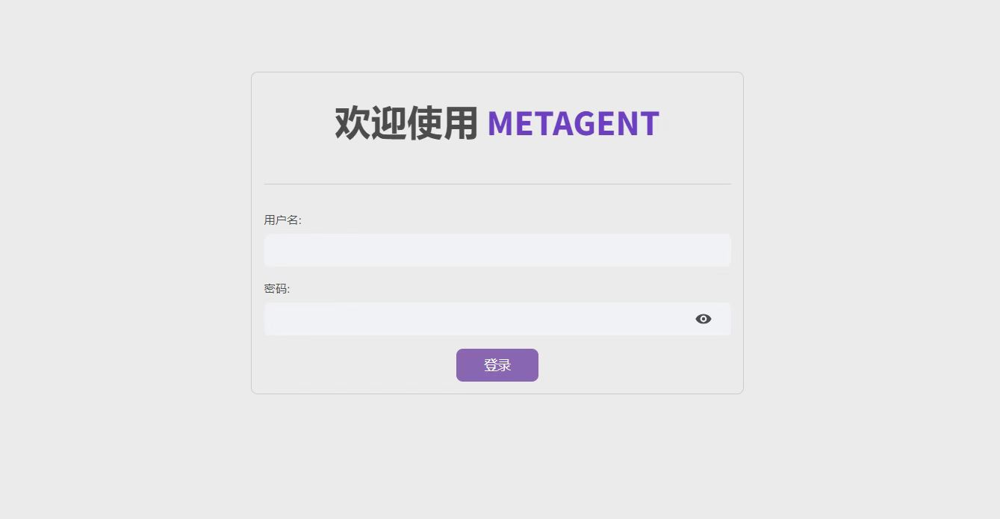
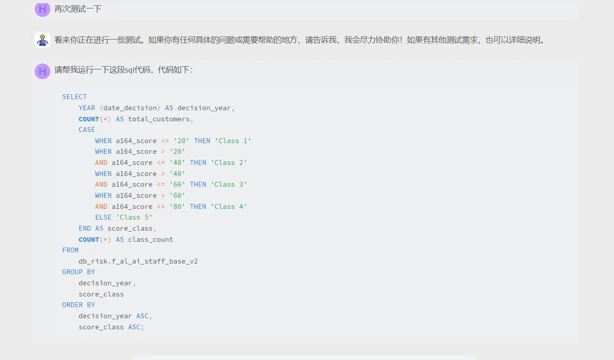

# Metagent

RAG, Agent, Prompt Engineering and WorkFlow






## Quick Start

### Business Background and Database Materials

Business background materials and database materials can be directly placed under `docs/RAG_Materials`.

### Document Retrieval

* Document retrieval uniformly uses the company platform's `bge-m3` to provide embeddings, without needing local downloads.
* Embedding documents are uniformly stored in `Vector_Store`.
* Multi-document retrieval schemes:
  1. You can put all documents into one document, for example, both 'UW' and 'auto-fraud' can be placed under `'CFCS_business_background.csv'`, for unified retrieval.
  2. Place documents separately in a list, and perform multiple retrievals in `agentic_workflow.py`:

```python
rag_01 = RagLLM(ds_chat, _BACKGROUND_DOC['UW_01'], 1000, 0, 3)
rag_02 = RagLLM(ds_chat, _BACKGROUND_DOC['UW_02'], 1000, 0, 3)
```

Document configuration in riskchat's `__init__.py`:

```python
_BACKGROUND_DOC = {'UW_01': 'CFCS_business_background.csv'}
_DB_SCHEMA_DOC = {'UW_01': 'table_info_f_al_ai_staff_base.csv'}
```

## 1. Project Overview

This document aims to introduce how to use Python modules to call large language models, utilize large predictive models for material queries,
SQL queries, and Python code, to automate a series of business processes.
Build personal workflows, improve business efficiency.

## 2. Module API Description

### 2.1 `chat_agent.py` * Chat Interface Module

#### Functionality

* Provides a function `ask_llm` to generate chat prompts and call the language model.
* Uses `langchain_core` library's `ChatPromptTemplate` and `StrOutputParser` to process chat prompts and outputs.
* Supports models using `model_list`:
  * Qwen, ERNIE (Baidu), Zhipu, Spark (Xunfei), deepseek, etc., online models.
  * llama, chatglm3, qwen2, etc., local large models.

#### Function Description `ask_llm`

* **Parameters**:
  * `model`: The language model function to call.
  * `user_question`: The question asked by the user.
  * `prompt_template`: The chat prompt template.
  * `**kwargs`: Additional keyword arguments.
* **Return Value**: Response string generated by the language model.

#### Workflow of the Function

1. Create a prompt using `ChatPromptTemplate.from_template` from the provided template.
2. Build a processing chain including obtaining the question, handling the prompt, calling the model, and parsing the output.
3. Call the model and pass in the user question and additional parameters.
4. Return the response from the model.

#### Example Usage

The script includes an example demonstrating how to use the `ask_llm` function. Below is the code snippet and explanation:

```python
# Import required modules and classes
from riskchat import ChatModel

# Define chat prompt template
prompt_template = '''
Role: You are a coding teacher.
Task: Write a summary based on my problem description.
Problem Description: {question}
Business Code: {code}
Running Result: {result}
'''

# Create language model instance
model_llm = ChatModel('deepseek-chat', 1).deepseek()

# Define user question and related parameters
question = 'Write a hello world in python'
code = 'print("hello, world")'
result = 'hello, world'

# Call ask_llm function and print result
ans = ask_llm(
    model=model_llm,
    user_question=question,
    prompt_template=prompt_template,
    code=code,
    result=result
)
print(ans)
```

### 2.2 `sql_agent.py` * SQL Query Module

#### Features

* Connects to MySQL databases and retrieves table structure information.
* Automatically generates SQL query statements based on user questions and background information.
* Executes SQL queries and returns results.
* Converts query results to Pandas DataFrame for data analysis.

#### Core Classes and Methods

##### ConnectSQL Class

* Responsible for establishing connections to the database and providing different types of database engines.
* `db_for_chain()`: Loads the database for use with `langchain`.
* `get_db_info()`: Prints table information of the database.
* `db_sqlalchemy()`: Creates an SQL engine for Pandas.

##### GetSQLChain Class

* Inherits from `ConnectSQL` class, adding SQL agent functionality for `langchain`.
* `__init__()`: Initializes the SQL agent, receiving the model, user question, background information, and table information.
* `write_query_split(x)`: Extracts SQL query statements from formatted SQL code blocks.
* `run_query(query)`: Executes the passed SQL query.
* `sql_scripts()`: Generates SQL scripts.
* `sql_results()`: Executes SQL scripts and returns results.
* `sql_to_pandas()`: Converts SQL query results to Pandas DataFrame.

#### Usage Example

Below is an example usage of the `GetSQLChain` class:

```python
from riskchat import GetSQLChain

# Assume model, user_question, background, table_info have been defined
sql_agent = GetSQLChain(model, user_question, background, table_info)
sql_script = sql_agent.sql_scripts()
print(sql_script)

# Execute SQL script and get results
results = sql_agent.sql_results()
print(results)

# Convert results to Pandas DataFrame
sql, df = sql_agent.sql_to_pandas()
print(sql)
print(df.head())
```

### 2.3 `python_agent.py` Python Code Generation Module

#### Functional Introduction

* Code generation: Generates corresponding Python code based on user questions and DataFrame information.
* Error Handling: Includes error handling mechanisms to ensure robustness of code execution.
* Retry Mechanism: Provides up to three retry attempts when encountering execution errors.

#### Main Classes and Methods

##### `PythonAgentError`

A custom exception class used for handling and throwing errors related to Python code execution.

##### `GetPythonChain`

* **Initialization** (`__init__`): Sets the model, question, DataFrame, and its name.
* **DataFrame Information** (`str_table_info`): Obtains basic information about the DataFrame.
* **Code Generation** (`python_scripts`): Generates Python code based on the question and DataFrame.
* **Execute Code** (`python_results`): Executes the generated Python code and returns the result.
* **Static Method** (`write_python_split`): Used to extract Python code from code blocks.

##### `py_explore`

A function that encapsulates the usage flow of `GetPythonChain`, including error handling and retry mechanism.

#### Code Example

```python
from python_agent import py_explore

# Assume there is a predefined model function `model_function` and user question `user_question`
model_function = ...
user_question = "Please calculate the average value of column 'A' based on DataFrame 'df'."
df = pd.DataFrame(...)  # Assume df is already defined DataFrame
df_name = "df"

# Call py_explore function to execute code generation and execution
result = py_explore(model_function, user_question, df, df_name)
print(result)
```

### 2.4 `rag_agent.py` RAG LLM Module, Text Retrieval

#### Function Description

The `RagLLM` class integrates functionalities for document loading, embedding model loading, text splitting, vector storage, and retrieval, and answers questions by invoking external models.

##### Initialization Method (`__init__`)

* Parameters include model name, file name, chunk size of text, overlap size of text, and top k documents number for the retriever.

##### Load Documents (`load_documents`)

* Selects appropriate loader based on file extension.
* Special handling for CSV files, reads column names.
* Splits text using `RecursiveCharacterTextSplitter`.

##### Load Embedding Model (`loading_embedding_model`)

* Loads `BgeEmbedding` model.

##### Embed Documents (`embed_documents`)

* Embeds loaded documents into vector store.

##### Retrieve Documents (`retriever`)

* Returns a retriever for retrieving relevant documents based on the question.

##### Format Documents (`format_docs`)

* Formats retrieved documents into strings.

##### Retrieve Documents (`retriever_docs`)

* Retrieves documents based on the question and returns formatted document content.

##### Retriever Chain (`retriever_chain`)

* Builds a retriever chain to pass the question and retrieved documents together to the model.

##### Auxiliary Functions

`rag_query` * Creates `RagLLM` instance and builds retriever chain.

`rag_query_with_history` * Allows history chat records to be considered during retrieval.

##### Code Reference

At the end of the `if __name__ == '__main__':` section, usage examples are provided, demonstrating how to use the `RagLLM` class.

## 3. Case Study (AR and RISK Workflow)

### Introduction  

`RiskWorkflow` encapsulates a risk workflow aimed at automating AR and RISK analysis.

### Step Descriptions  

1. **Business Logic Background Analysis**: Conduct business background retrieval through RAG based on user questions.
2. **Database Field Analysis and Extraction**: Extract all possible database fields based on user questions and retrieved business backgrounds.
3. **Load Database Schema**: Search for corresponding database fields in schema based on database fields extracted by the large model.
4. **Generate SQL Code**: Generate SQL code based on user background, context, and retrieved database schema.
5. **Execute SQL Code**: Execute SQL code and return final data, converted into DataFrame format.
6. **Report Generation**: Generate reports based on user questions, business logic, and final data.

### Notes

Single token consumption around 5000 (input + output).

## 4. Version Information

* Date: 2024-10-24
* Author: HugozhangTJ
* Version: 0.0.2
